```mermaid
classDiagram
    direction TB

    %% ══════════════════════════════════════════════════════════════
    %% DOMAIN — ENTIDADES
    %% ══════════════════════════════════════════════════════════════

    class SpaceEquipment {
        <<abstract>>
        +int Id
        +string Name
        +string? Summary
        +DataConfidence DataConfidence
        +DateTime RegisteredAt
        +DateTime? LastUpdatedAt
        +GetEquipmentCategory() string*
        +UpdateTimestamp() void
    }

    class OrbitalObject {
        +string? NoradId
        +OrbitalObjectType Type
        +ObjectStatus Status
        +OrbitRegion OrbitRegion
        +double AltitudeKm
        +double InclinationDeg
        +int? LaunchYear
        +double? EstimatedMassKg
        +double? EstimatedSizeM
        +ICollection~MissionScenario~ Missions
        +ICollection~ReuseMaterialEstimate~ MaterialEstimates
        +Create(...)$ OrbitalObject
        +Update(...) void
        +GetEquipmentCategory() string
        +IsHighRisk() bool
    }

    class MissionScenario {
        +int OrbitalObjectId
        +OrbitalObject? OrbitalObject
        +string Objective
        +MissionType Type
        +RiskLevel RiskLevel
        +int EstimatedDurationDays
        +double? EstimatedDeltaVMps
        +DateTime? PlannedStartUtc
        +DateTime? CompletedAt
        +Create(...)$ MissionScenario
        +Complete() void
        +IsOverdue() bool
        +GetProgressCheckpoints(int) IEnumerable~DateTime~
        +DaysRemainingUntilDeadline() int
        +GetEquipmentCategory() string
    }

    class ReuseMaterialEstimate {
        +int OrbitalObjectId
        +OrbitalObject? OrbitalObject
        +MaterialType Material
        +RiskLevel RecoveryPotential
        +RecoveryPath PreferredPath
        +double EstimatedSharePct
        +string? Notes
        +Create(...)$ ReuseMaterialEstimate
        +GetEquipmentCategory() string
    }

    class User {
        +int Id
        +string Name
        +string Email
        +string PasswordHash
        +string Role
        +DateTime CreatedAt
        +DateTime? LastLoginAt
        +bool IsActive
        +Create(...)$ User
        +RecordLogin() void
        +Deactivate() void
    }

    SpaceEquipment <|-- OrbitalObject : extends
    SpaceEquipment <|-- MissionScenario : extends
    SpaceEquipment <|-- ReuseMaterialEstimate : extends
    OrbitalObject "1" --> "0..*" MissionScenario : Missions
    OrbitalObject "1" --> "0..*" ReuseMaterialEstimate : MaterialEstimates
    MissionScenario --> OrbitalObject : OrbitalObject
    ReuseMaterialEstimate --> OrbitalObject : OrbitalObject

    %% ══════════════════════════════════════════════════════════════
    %% DOMAIN — INTERFACES DE REPOSITÓRIO
    %% ══════════════════════════════════════════════════════════════

    class IRepository~T~ {
        <<interface>>
        +GetByIdAsync(int id) Task~T?~
        +GetAllAsync() Task~IEnumerable~T~~
        +AddAsync(T entity) Task
        +Update(T entity) void
        +Delete(T entity) void
        +SaveChangesAsync() Task
    }

    class IOrbitalObjectRepository {
        <<interface>>
        +GetByRegionAsync(OrbitRegion) Task~IEnumerable~OrbitalObject~~
        +GetByTypeAsync(OrbitalObjectType) Task~IEnumerable~OrbitalObject~~
        +GetHighRiskAsync() Task~IEnumerable~OrbitalObject~~
        +GetByNoradIdAsync(string) Task~OrbitalObject?~
    }

    class IMissionRepository {
        <<interface>>
        +GetByOrbitalObjectIdAsync(int) Task~IEnumerable~MissionScenario~~
        +GetOverdueAsync() Task~IEnumerable~MissionScenario~~
    }

    class IReuseMaterialRepository {
        <<interface>>
        +GetByOrbitalObjectIdAsync(int) Task~IEnumerable~ReuseMaterialEstimate~~
    }

    class IUserRepository {
        <<interface>>
        +GetByEmailAsync(string) Task~User?~
    }

    IRepository~T~ <|-- IOrbitalObjectRepository : extends
    IRepository~T~ <|-- IMissionRepository : extends
    IRepository~T~ <|-- IReuseMaterialRepository : extends
    IRepository~T~ <|-- IUserRepository : extends

    %% ══════════════════════════════════════════════════════════════
    %% APPLICATION — INTERFACES DE SERVIÇO
    %% ══════════════════════════════════════════════════════════════

    class IOrbitalObjectService {
        <<interface>>
        +GetAllAsync() Task~IEnumerable~OrbitalObjectDto~~
        +GetByIdAsync(int) Task~OrbitalObjectDto?~
        +GetByRegionAsync(OrbitRegion) Task~IEnumerable~OrbitalObjectDto~~
        +GetHighRiskAsync() Task~IEnumerable~OrbitalObjectDto~~
        +GetScoresAsync(int) Task~OrbitalObjectScoresDto~
        +CreateAsync(CreateOrbitalObjectRequest) Task~OrbitalObjectDto~
        +UpdateAsync(int, UpdateOrbitalObjectRequest) Task~OrbitalObjectDto~
        +DeleteAsync(int) Task
    }

    class IMissionService {
        <<interface>>
        +GetAllAsync() Task~IEnumerable~MissionDto~~
        +GetByIdAsync(int) Task~MissionDto?~
        +GetByOrbitalObjectAsync(int) Task~IEnumerable~MissionDto~~
        +GetOverdueAsync() Task~IEnumerable~MissionDto~~
        +CreateAsync(CreateMissionRequest) Task~MissionDto~
        +CompleteAsync(int) Task~MissionDto~
        +GetCheckpointsAsync(int, int) Task~IEnumerable~DateTime~~
        +DeleteAsync(int) Task
    }

    class IReuseMaterialService {
        <<interface>>
        +GetAllAsync() Task~IEnumerable~ReuseMaterialDto~~
        +GetByIdAsync(int) Task~ReuseMaterialDto?~
        +GetByOrbitalObjectAsync(int) Task~IEnumerable~ReuseMaterialDto~~
        +CreateAsync(CreateReuseMaterialRequest) Task~ReuseMaterialDto~
        +DeleteAsync(int) Task
    }

    class IAuthService {
        <<interface>>
        +RegisterAsync(RegisterRequest) Task~AuthResponse~
        +LoginAsync(LoginRequest) Task~AuthResponse~
    }

    class IReportService {
        <<interface>>
        +GetRegionReportAsync() Task~OrbitalRegionReportDto~
        +GetAlertWindowsAsync(int, int, int) Task~IEnumerable~AlertWindowDto~~
        +GetFleetRiskScoreAsync() Task~int~
    }

    %% ══════════════════════════════════════════════════════════════
    %% SERVICES — IMPLEMENTAÇÕES
    %% ══════════════════════════════════════════════════════════════

    class OrbitalObjectService {
        -IOrbitalObjectRepository _repo
        -ILogger _logger
        +GetAllAsync() Task~IEnumerable~OrbitalObjectDto~~
        +GetByIdAsync(int) Task~OrbitalObjectDto?~
        +GetByRegionAsync(OrbitRegion) Task~IEnumerable~OrbitalObjectDto~~
        +GetHighRiskAsync() Task~IEnumerable~OrbitalObjectDto~~
        +GetScoresAsync(int) Task~OrbitalObjectScoresDto~
        +CreateAsync(CreateOrbitalObjectRequest) Task~OrbitalObjectDto~
        +UpdateAsync(int, UpdateOrbitalObjectRequest) Task~OrbitalObjectDto~
        +DeleteAsync(int) Task
    }

    class MissionService {
        -IMissionRepository _missionRepo
        -IOrbitalObjectRepository _objectRepo
        -ILogger _logger
        +GetAllAsync() Task~IEnumerable~MissionDto~~
        +GetByIdAsync(int) Task~MissionDto?~
        +GetByOrbitalObjectAsync(int) Task~IEnumerable~MissionDto~~
        +GetOverdueAsync() Task~IEnumerable~MissionDto~~
        +CreateAsync(CreateMissionRequest) Task~MissionDto~
        +CompleteAsync(int) Task~MissionDto~
        +GetCheckpointsAsync(int, int) Task~IEnumerable~DateTime~~
        +DeleteAsync(int) Task
    }

    class ReuseMaterialService {
        -IReuseMaterialRepository _repo
        -ILogger _logger
        +GetAllAsync() Task~IEnumerable~ReuseMaterialDto~~
        +GetByIdAsync(int) Task~ReuseMaterialDto?~
        +GetByOrbitalObjectAsync(int) Task~IEnumerable~ReuseMaterialDto~~
        +CreateAsync(CreateReuseMaterialRequest) Task~ReuseMaterialDto~
        +DeleteAsync(int) Task
    }

    class AuthService {
        -IUserRepository _repo
        -IConfiguration _config
        -ILogger _logger
        +RegisterAsync(RegisterRequest) Task~AuthResponse~
        +LoginAsync(LoginRequest) Task~AuthResponse~
        -ValidatePasswordComplexity(string)$ void
        -MaskEmail(string)$ string
        -GenerateToken(User) AuthResponse
    }

    class ReportService {
        -IOrbitalObjectRepository _repo
        +GetRegionReportAsync() Task~OrbitalRegionReportDto~
        +GetAlertWindowsAsync(int, int, int) Task~IEnumerable~AlertWindowDto~~
        +GetFleetRiskScoreAsync() Task~int~
    }

    class ScoringService {
        <<static>>
        +Calculate(OrbitalObject)$ OrbitalObjectScoresDto
        -CalculateRiskScore(OrbitalObject)$ ScoreResultDto
        -CalculateForgeValueScore(OrbitalObject)$ ScoreResultDto
        -CalculatePriorityScore(OrbitalObject, int, int)$ ScoreResultDto
        -GetRecommendation(int, int)$ string
    }

    class OrbitalReportService {
        <<static>>
        +GenerateRegionReport(IEnumerable~OrbitalObject~)$ OrbitalRegionReportDto
        +GenerateAlertWindows(OrbitalObject, DateTime, int, int)$ IEnumerable~AlertWindowDto~
        +CalculateTotalRiskScore(IEnumerable~OrbitalObject~)$ int
    }

    IOrbitalObjectService <|.. OrbitalObjectService : implements
    IMissionService <|.. MissionService : implements
    IReuseMaterialService <|.. ReuseMaterialService : implements
    IAuthService <|.. AuthService : implements
    IReportService <|.. ReportService : implements

    OrbitalObjectService --> IOrbitalObjectRepository : uses
    OrbitalObjectService --> ScoringService : uses
    MissionService --> IMissionRepository : uses
    MissionService --> IOrbitalObjectRepository : uses
    ReuseMaterialService --> IReuseMaterialRepository : uses
    AuthService --> IUserRepository : uses
    OrbitalReportService --> ScoringService : uses
    ReportService --> IOrbitalObjectRepository : uses
    ReportService --> OrbitalReportService : uses

    %% ══════════════════════════════════════════════════════════════
    %% DOMAIN — EXCEÇÕES
    %% ══════════════════════════════════════════════════════════════

    class DomainException {
        <<abstract>>
        +string Message
    }

    class OrbitalObjectNotFoundException {
        +OrbitalObjectNotFoundException(int id)
        +OrbitalObjectNotFoundException(string noradId)
    }

    class MissionNotFoundException {
        +MissionNotFoundException(int id)
    }

    class ReuseMaterialNotFoundException {
        +ReuseMaterialNotFoundException(int id)
    }

    class InvalidOrbitalDataException {
        +string Field
        +string Reason
        +InvalidOrbitalDataException(string field, string reason)
    }

    class DuplicateNoradIdException {
        +string NoradId
        +DuplicateNoradIdException(string noradId)
    }

    class MissionAlreadyCompletedException {
        +int MissionId
        +MissionAlreadyCompletedException(int missionId)
    }

    DomainException <|-- OrbitalObjectNotFoundException : extends
    DomainException <|-- MissionNotFoundException : extends
    DomainException <|-- ReuseMaterialNotFoundException : extends
    DomainException <|-- InvalidOrbitalDataException : extends
    DomainException <|-- DuplicateNoradIdException : extends
    DomainException <|-- MissionAlreadyCompletedException : extends

    %% ══════════════════════════════════════════════════════════════
    %% DOMAIN — ENUMS
    %% ══════════════════════════════════════════════════════════════

    class OrbitRegion {
        <<enumeration>>
        LEO
        MEO
        GEO
        HEO
    }

    class OrbitalObjectType {
        <<enumeration>>
        Satellite
        RocketBody
        Debris
        Unknown
    }

    class ObjectStatus {
        <<enumeration>>
        Active
        Inactive
        Fragment
        Unknown
    }

    class DataConfidence {
        <<enumeration>>
        Confirmed
        Estimated
        Unknown
        Simulated
    }

    class MissionType {
        <<enumeration>>
        Monitor
        Inspect
        Avoid
        Deorbit
        MoveToSaferOrbit
        Capture
        Recycle
    }

    class RiskLevel {
        <<enumeration>>
        Low
        Medium
        High
    }

    class MaterialType {
        <<enumeration>>
        Aluminum
        Titanium
        Composite
        Electronics
        Unknown
    }

    class RecoveryPath {
        <<enumeration>>
        Repair
        Refuel
        Recycle
        Deorbit
    }

    OrbitalObject --> OrbitRegion
    OrbitalObject --> OrbitalObjectType
    OrbitalObject --> ObjectStatus
    OrbitalObject --> DataConfidence
    MissionScenario --> MissionType
    MissionScenario --> RiskLevel
    MissionScenario --> DataConfidence
    ReuseMaterialEstimate --> MaterialType
    ReuseMaterialEstimate --> RiskLevel
    ReuseMaterialEstimate --> RecoveryPath
    ReuseMaterialEstimate --> DataConfidence
```

# Diagrama de Classes — Kessler API

> Diagrama completo da arquitetura de classes da solução.

## Como visualizar

**Opção 1 — GitHub (Mermaid automático)**  
Abra este arquivo diretamente no GitHub — o diagrama é renderizado automaticamente.

**Opção 2 — HTML interativo (recomendado para zoom e navegação)**  
Faça o download ou clone o repositório e abra o arquivo no navegador:
```
kessler-diagrama-classes.html
```
> Basta dar duplo clique no arquivo ou arrastar para o navegador. Não requer servidor.

---



---

## Legenda

| Símbolo | Significado |
|---------|------------|
| `<<abstract>>` | Classe abstrata |
| `<<interface>>` | Interface |
| `<<static>>` | Classe estática (todos os membros são estáticos) |
| `<<enumeration>>` | Enum |
| `method()*` | Método abstrato |
| `method()$` | Método estático |
| `+` | Public |
| `-` | Private |
| `<\|--` | Herança / Implementação de interface |
| `<\|..` | Realização (implementa interface) |
| `-->` | Associação / Dependência |

## Resumo da Arquitetura

```
Kessler.Domain          ← núcleo, zero dependências externas
   Entities             ← SpaceEquipment (abstract), OrbitalObject,
                           MissionScenario, ReuseMaterialEstimate, User
   Interfaces           ← IRepository<T>, IOrbitalObject/Mission/ReuseMaterial/UserRepository
   Exceptions           ← DomainException (abstract) + 6 exceções específicas
   Enums                ← 8 enums de domínio
   Constants            ← OrbitConstants, ScoringConstants, MissionConstants, SecurityConstants

Kessler.Application     ← depende de Domain
   DTOs                 ← 6 arquivos de DTOs com Data Annotations de validação
   Interfaces           ← IOrbitalObjectService, IMissionService,
                           IReuseMaterialService, IAuthService, IReportService

Kessler.Services        ← depende de Domain + Application
   OrbitalObjectService, MissionService, ReuseMaterialService, AuthService,
   ReportService
   ScoringService (static), OrbitalReportService (static)

Kessler.Infrastructure  ← depende de Domain + Application
   KesslerDbContext (EF Core 8 + Oracle)
   BaseRepository<T> + 4 repositórios concretos
   Migrations/

Kessler.API             ← depende de Application + Services + Infrastructure
   5 Controllers (Auth, OrbitalObjects, Missions, ReuseMaterials, Reports)
   5 Middlewares (SecurityHeaders, Exception, Sanitization, PayloadIntegrity, Audit)
   Program.cs
```
