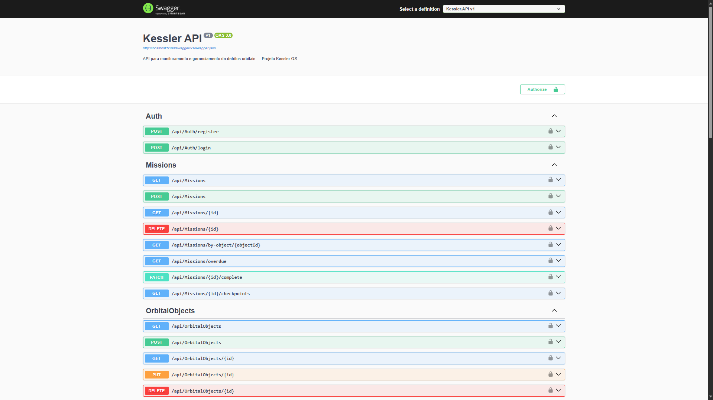
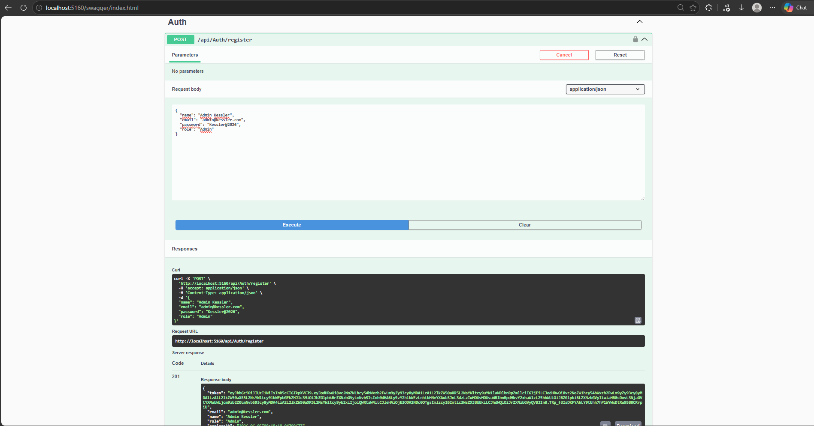
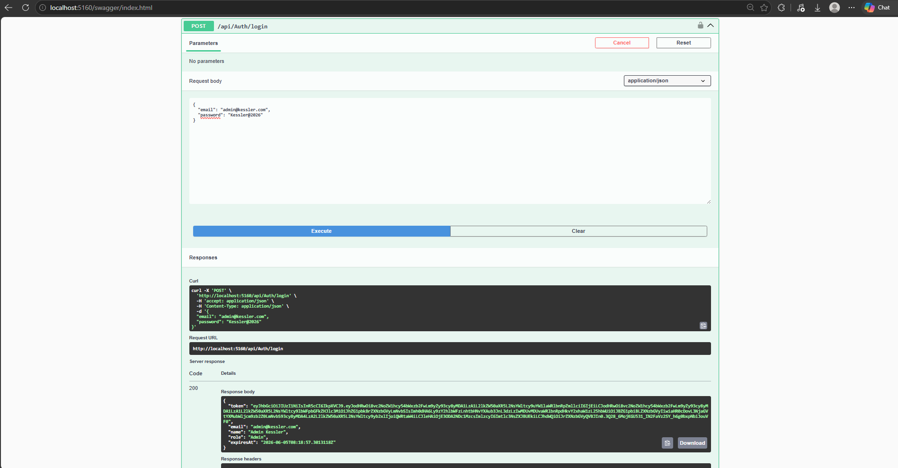
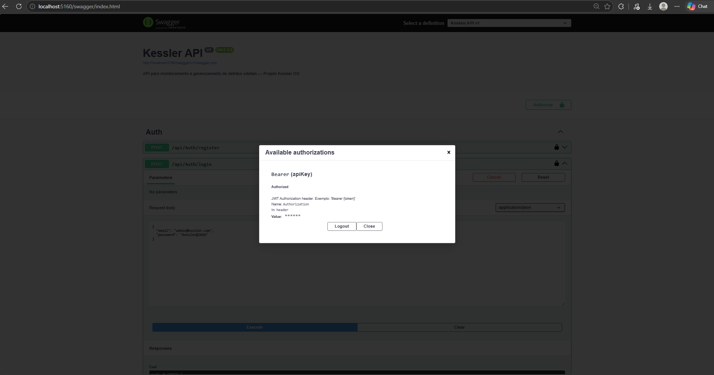
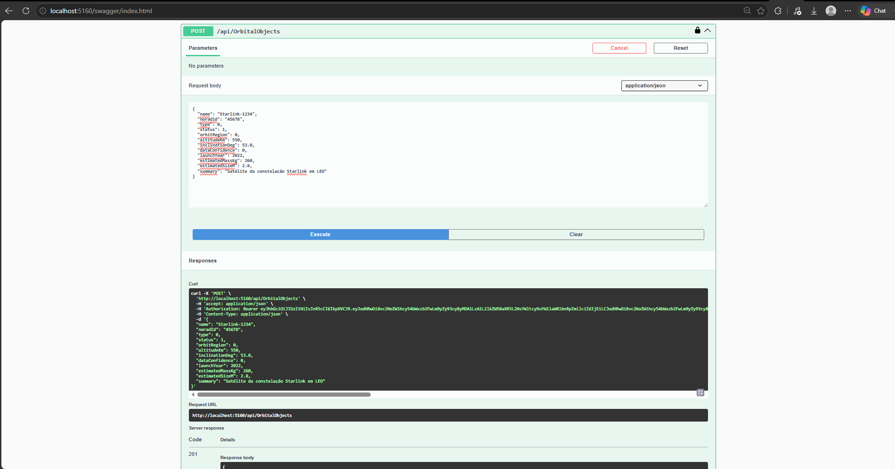
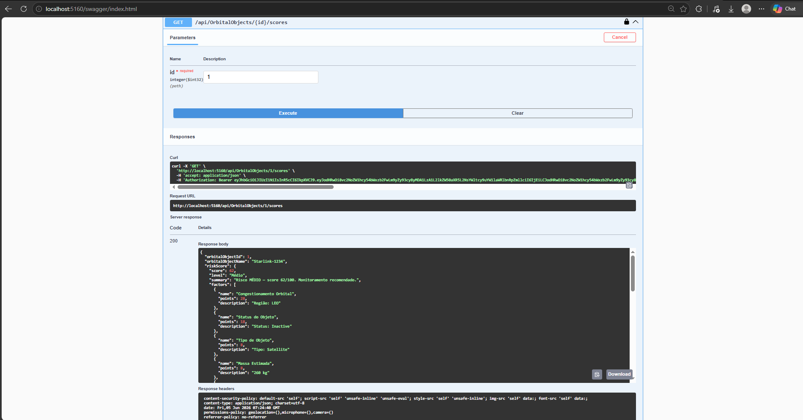
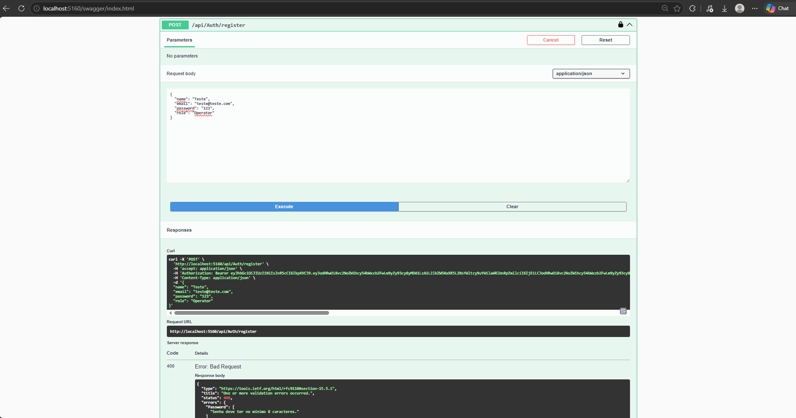
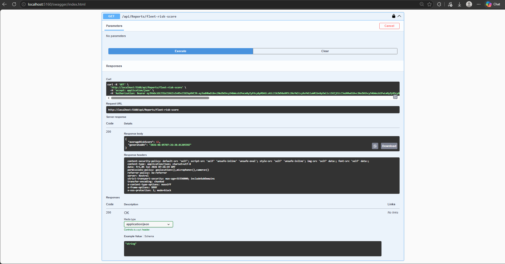

# Kessler API

<p align="center">
  
</p>

> API RESTful para monitoramento, priorização e gerenciamento de detritos orbitais — baseada no ecossistema Kessler OS.

## Tema e Motivação

O [Efeito Kessler](https://en.wikipedia.org/wiki/Kessler_syndrome) descreve um cenário onde a densidade de detritos em órbita terrestre baixa (LEO) atinge um ponto crítico, gerando colisões em cascata que impossibilitariam o uso da órbita por séculos. Com mais de 27.000 objetos rastreados e milhões de fragmentos não rastreados, este problema representa uma ameaça real à infraestrutura global de satélites — GPS, comunicações, meteorologia e internet.

A **Kessler API** é a camada de backend que sustenta o Kessler OS: um sistema de análise, priorização e simulação de missões espaciais para mitigação de detritos orbitais. A solução conecta ciência de dados orbitais com tomada de decisão estruturada, promovendo a sustentabilidade do espaço (alinhada ao ODS 9 — Indústria, Inovação e Infraestrutura).

## Integrantes

| Nome | RM |
|------|----|
| Carlos Henrique | RM558003 |
| Mauricio Alves | RM556214 |
| Ian Monteiro | RM558652 |
| Bruno Silva | RM550416 |
| João Hoffmann | RM550763 |

## Diagrama de Classes

O diagrama completo de classes está disponível em duas formas:
- **[DIAGRAMA-CLASSES.md](DIAGRAMA-CLASSES.md)** — renderizado pelo GitHub via Mermaid
- **[kessler-diagrama-classes.html](kessler-diagrama-classes.html)** — versão interativa, abra no navegador (duplo clique no arquivo após clonar o repositório)

## Arquitetura

```
kesslerAPI/
├── Kessler.Domain/          # Núcleo — entidades, enums, interfaces (sem dependências externas)
│   ├── Entities/            # SpaceEquipment (abstract), OrbitalObject, MissionScenario,
│   │                        #   ReuseMaterialEstimate, User
│   ├── Enums/               # OrbitRegion, OrbitalObjectType, ObjectStatus, DataConfidence,
│   │                        #   MissionType, RiskLevel, MaterialType, RecoveryPath
│   ├── Interfaces/          # IRepository<T>, IOrbitalObjectRepository, IMissionRepository,
│   │                        #   IReuseMaterialRepository, IUserRepository
│   ├── Exceptions/          # DomainException (base), OrbitalObjectNotFoundException,
│   │                        #   MissionNotFoundException, ReuseMaterialNotFoundException,
│   │                        #   InvalidOrbitalDataException, DuplicateNoradIdException,
│   │                        #   MissionAlreadyCompletedException
│   └── Constants/           # OrbitConstants, ScoringConstants, MissionConstants,
│                            #   SecurityConstants
├── Kessler.Application/     # DTOs e contratos de serviço (sem implementações)
│   ├── DTOs/                # OrbitalObjectDto, MissionDto, ReuseMaterialDto, ScoreDto,
│   │                        #   AuthDto, ReportDto
│   └── Interfaces/          # IOrbitalObjectService, IMissionService,
│                            #   IReuseMaterialService, IAuthService, IReportService
├── Kessler.Services/        # Implementações concretas dos serviços de negócio
│   ├── OrbitalObjectService.cs
│   ├── MissionService.cs
│   ├── ReuseMaterialService.cs
│   ├── AuthService.cs
│   ├── ReportService.cs
│   ├── ScoringService.cs       # Cálculo de RiskScore, ForgeValue, Priority (estático)
│   └── OrbitalReportService.cs # Relatórios por região e janelas de alerta (estático)
├── Kessler.Infrastructure/  # EF Core + Oracle, repositórios concretos, migrations
│   ├── Data/                # KesslerDbContext
│   ├── Repositories/        # BaseRepository<T>, OrbitalObjectRepository,
│   │                        #   MissionRepository, ReuseMaterialRepository, UserRepository
│   └── Migrations/          # Migrations geradas para Oracle
└── Kessler.API/             # Controllers ASP.NET Core, Middleware, Program.cs
    ├── Controllers/         # AuthController, OrbitalObjectsController, MissionsController,
    │                        #   ReuseMaterialsController, ReportsController
    ├── Middleware/          # SecurityHeadersMiddleware, ExceptionMiddleware,
    │                        #   SanitizationMiddleware, PayloadIntegrityMiddleware,
    │                        #   AuditMiddleware
    └── Properties/          # launchSettings.json
```

**Dependências (Arquitetura em Cebola):**
```
Domain (núcleo — zero dependências)
   ↑           ↑           ↑
Application  Services  Infrastructure
   ↑           ↑           ↑
         Kessler.API
```

## Tecnologias

- **.NET 8** / **ASP.NET Core Web API**
- **Entity Framework Core 8** + **Oracle Database** (Oracle.EntityFrameworkCore)
- **JWT Bearer Authentication** (Microsoft.AspNetCore.Authentication.JwtBearer)
- **BCrypt.Net-Next** (hash de senhas)
- **Swagger / OpenAPI**
- **Rate Limiting** integrado ao ASP.NET Core

## Endpoints Principais

| Método | Rota | Autenticação | Descrição |
|--------|------|-------------|-----------|
| POST | /api/auth/register | ❌ | Registra usuário |
| POST | /api/auth/login | ❌ | Autenticação + retorna JWT |
| GET | /api/orbitalobjects | ✅ | Lista todos os objetos orbitais |
| GET | /api/orbitalobjects/{id} | ✅ | Retorna objeto por ID |
| GET | /api/orbitalobjects/{id}/scores | ✅ | Scores de risco, reaproveitamento e prioridade |
| GET | /api/orbitalobjects/high-risk | ✅ | Objetos de alto risco |
| GET | /api/orbitalobjects/region/{region} | ✅ | Filtra por região (LEO/MEO/GEO/HEO) |
| POST | /api/orbitalobjects | ✅ | Cadastra objeto orbital |
| PUT | /api/orbitalobjects/{id} | ✅ | Atualiza objeto orbital |
| DELETE | /api/orbitalobjects/{id} | ✅ Admin | Remove objeto orbital |
| GET | /api/missions | ✅ | Lista todas as missões |
| GET | /api/missions/{id} | ✅ | Retorna missão por ID |
| GET | /api/missions/{id}/checkpoints | ✅ | Checkpoints de progresso da missão |
| GET | /api/missions/by-object/{objectId} | ✅ | Missões de um objeto orbital |
| GET | /api/missions/overdue | ✅ | Missões com prazo vencido |
| POST | /api/missions | ✅ | Cria missão |
| PATCH | /api/missions/{id}/complete | ✅ | Conclui missão |
| DELETE | /api/missions/{id} | ✅ Admin | Remove missão |
| GET | /api/reusematerials | ✅ | Lista estimativas de reaproveitamento |
| GET | /api/reusematerials/{id} | ✅ | Retorna estimativa por ID |
| GET | /api/reusematerials/by-object/{objectId} | ✅ | Estimativas de um objeto orbital |
| POST | /api/reusematerials | ✅ | Cria estimativa de reaproveitamento |
| DELETE | /api/reusematerials/{id} | ✅ Admin | Remove estimativa |
| GET | /api/reports/region-summary | ✅ | Relatório consolidado por região orbital |
| GET | /api/reports/alert-windows/{objectId} | ✅ | Janelas temporais de alerta de um objeto |
| GET | /api/reports/fleet-risk-score | ✅ | Score médio de risco de toda a frota |

## Como Executar

### Pré-requisitos
- .NET 8 SDK
- Oracle Database 19c / 21c / XE (local ou Docker)

### Configuração

1. Clone o repositório e entre na pasta:
```bash
git clone https://github.com/ianmonteirom/kesslerAPI.git
cd kesslerAPI
```

2. Ajuste a senha em `Kessler.API/appsettings.json`:
```json
"ConnectionStrings": {
  "DefaultConnection": "Data Source=(DESCRIPTION=(ADDRESS=(PROTOCOL=TCP)(HOST=oracle.fiap.com.br)(PORT=1521))(CONNECT_DATA=(SID=ORCL)));User Id=rm558652;Password=SUA_SENHA;"
}
```
> Substitua `SUA_SENHA` pela senha do seu usuário Oracle FIAP. As tabelas são criadas automaticamente no schema `RM558652`.

3. Execute a API (as migrações são aplicadas automaticamente):
```bash
dotnet run --project Kessler.API
```

4. Acesse o Swagger UI:
```
https://localhost:{porta}/swagger
```

5. Registre um usuário via `POST /api/auth/register`, faça login e use o token JWT no botão **Authorize** do Swagger.

## Sistema de Pontuação (Scoring)

Cada objeto orbital recebe três scores calculados pelo `ScoringService`:

| Score | Pesos | Resultado |
|-------|-------|-----------|
| **Risco Orbital** | Região (28) + Status (22) + Tipo (20) + Massa (16) + Confiança (10) | 0-100 → Baixo/Médio/Alto |
| **Forge Value** | Massa (26) + Tipo (20) + Acessibilidade (20) + Status (18) + Confiança (14) - Penalidade | 0-100 |
| **Prioridade** | Risco×58% + Reuse×24% + Viabilidade×18% | 0-100 |

## Cybersecurity

A análise completa de segurança está em [SECURITY.md](SECURITY.md), cobrindo: Identificação de Ativos, Modelo de Ameaças, Controles de Acesso, Proteção de Dados, Segurança da Infraestrutura, ISO 27001, LGPD e Plano de Resposta a Incidentes.

### Controles Implementados

| Pilar | Controle | Implementação |
|-------|----------|--------------|
| **Acesso** | Autenticação | JWT Bearer HS256 — expiração de 60 min, claims `sub` + `role` |
| **Acesso** | Autorização | RBAC: `Admin` (CRUD completo) / `Operator` (leitura e escrita, sem DELETE) |
| **Acesso** | Mínimo Privilégio | Endpoints `DELETE` decorados com `[Authorize(Roles = "Admin")]` |
| **Dados** | Senhas | BCrypt hash — algoritmo lento, resistente a rainbow tables |
| **Dados** | Trânsito | HSTS (`max-age=31536000`) — força HTTPS em todas as conexões |
| **Dados** | Erros | `ExceptionMiddleware` — nunca expõe stack traces ou detalhes internos |
| **Infra** | Headers HTTP | X-Frame-Options, CSP, X-XSS-Protection, X-Content-Type-Options, Server removido |
| **Infra** | Rate Limiting | 100 req/min por IP — `FixedWindow`, resposta `429` |
| **Infra** | Anti-Injeção | EF Core com queries parametrizadas — proteção automática contra SQL Injection |
| **Infra** | Logs | `ILogger` estruturado em todos os serviços de aplicação |

### Ativos Críticos

Os principais ativos protegidos pelo sistema são: dados orbitais (posição, NORAD ID, risco), credenciais de usuários, tokens JWT, chave secreta JWT e connection string do Oracle. Detalhes em [SECURITY.md § 1.1](SECURITY.md#11-identificação-de-ativos).

### Vetores de Ameaça Identificados

| # | Vetor | Controle |
|---|-------|---------|
| 1 | Interceptação JWT (MITM) | HTTPS/TLS obrigatório via HSTS |
| 2 | Brute Force no login | Rate Limiting + BCrypt |
| 3 | SQL Injection / Data Tampering | EF Core parametrizado + validação de domínio |
| 4 | DDoS / Abuso de API | Rate Limiting 100 req/min/IP |
| 5 | Escalada de Privilégios | RBAC com JWT claims imutáveis |

### Plano de Resposta a Incidentes (resumo)

| Fase | Janela | Ações-chave |
|------|--------|-------------|
| **Contenção** | 0–2h | Isolar API, revogar/rotacionar chave JWT, bloquear IPs, preservar logs |
| **Erradicação** | 2–24h | Análise forense, corrigir vulnerabilidade, verificar integridade dos dados |
| **Recuperação** | 24–72h | Restaurar serviço, monitoramento intensivo, notificar usuários (LGPD Art. 48) |

> Detalhamento completo de cada fase em [SECURITY.md § 4](SECURITY.md#4-plano-de-resiliência-e-continuidade).

## Evidências de Execução

### 1. Swagger UI — API em execução


### 2. Registro de usuário — `POST /api/auth/register` (201)


### 3. Login e token JWT — `POST /api/auth/login` (200)


### 4. Autorização com Bearer Token no Swagger


### 5. Criação de objeto orbital — `POST /api/orbitalobjects` (201)


### 6. Scores de risco e prioridade — `GET /api/orbitalobjects/{id}/scores`


### 7. Erro tratado — validação de senha fraca (400)


### 8. Relatório de risco da frota — `GET /api/reports/fleet-risk-score`

